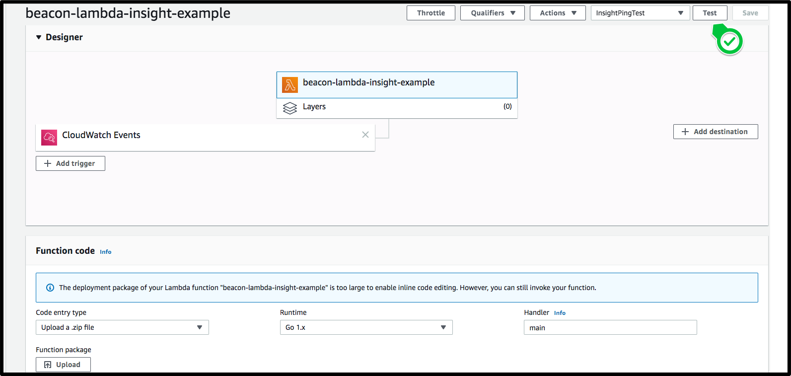

**Publish Custom Beacon Insights using Beacon lambda example**

The **Insights View** page within F5 Beacon is a centralized location to get insightful information about your application ecosystem.
Insights are divided into three categories **Cost**, **Operations** and **Security**.

Beacon has built-in insights, such as the 'F5 Assets and Inventory' insight detailing F5 assets acting as Beacon sources. In addition to built-in insights,Beacon users can generate custom insights and publish them to Beacon.


**Custom Insights**

In this section, we will detail how to utilize the Ping metrics to build a **Ping Insight**.
We will utilize an AWS Lambda function to periodically query Beacon metrics and update the insight with packet loss information for the last hour.  Metrics can be published from any environment -- public cloud, private server or from a local machine.
The only requirement is accessibility to the Beacon insights API.
As mentioned, in this example we will build a Lambda function in Golang with the following handler entry point:

```go
    func handler(functionInput FunctionInput) error {

        fmt.Println("Starting processing Ping Insight")

        loginResp, err := login(LoginRequest{
            Username: functionInput.Username,
            Password: functionInput.Password,
        })
        if err != nil {
            return err
        }

        insight, err := buildPingInsight(loginResp.AccessToken, functionInput.Account)
        if err != nil {
            return err
        }

        publishInsight(loginResp.AccessToken, functionInput.Account, insight)
        return nil
    }
```

The handler function describes the main operations of the Lambda function:

  * **Login** - Login to F5 Cloud Services to obtain an API token
  * **Build Ping insight** - Query for metrics and create an insight struct
  * **Publish insight** - publish the insight to Beacon

**Log in**

The Lambda function is logging in to F5 Cloud Service.
   The 'Username', 'Password' and 'Prefered account' used to authenticate and execute API calls against Beacon are provided in the Lambda function JSON input.
  The JSON input fields are defined as below
   ```json
    {
      "username": "",
      "password": "",
      "account": ""
    }
   ```
   This is done for simplicity.  In a production environment, it is recommended to use secure storage to access credentials, such as HashCorp Vault or AWS Secret Manager.


Build Insight
------------------
To build a Ping Insight we are querying the ping metric . After getting the value
we construct an Insight with a title, description, and detailed markdown content.

For this insight, we categorize it as 'Operational' dynamically set the severity based on the metric value.

```go
    // Build a Beacon insight based on ping metric results
    func buildPingInsight(token string, account string) (*InsightRequest, error) {

        // Query the ping metric
        pingPacketLossPercentage, err := queryPingMetric(token, account)
        if err != nil {
            fmt.Printf("Unable to query for Ping metrics %s\n", err.Error())
            return nil, err
        }

        severity := "INS_SEV_MODERATE"
        if pingPacketLossPercentage == 0 {
            severity = "INS_SEV_INFORMATIONAL"
        }

        // Build insight request body
        var insightRequest = InsightRequest{
            Title:           "Ping Insight",
            Description:     "Periodic Ping Test Insight",
            MarkdownContent: fmt.Sprintf("### Ping result\n Ping average lost packet %.2f", pingPacketLossPercentage),
            Category:        "INS_CAT_OPERATIONS",
            Severity:        severity,
        }
        return &insightRequest, nil
    }
```

Publish Insight
------------------
The last step is to publish the insight to Overwatch.
   ```go

    // Publish the insight to Overwatch
    func publishInsight(token string, account string, insight *InsightRequest) {

        urlPath := "https://api.cloudservices.f5.com/v1/svc-overwatch/insights"
        verb := http.MethodPost
        inputByte, err := json.Marshal(insight)
        if err != nil {
            fmt.Printf("Failed to create json from body new request %s\n", err.Error())
            return
        }

        req, err := createHttpRequest(verb, urlPath, inputByte, token, account)
        if err != nil {
            return
        }

        _, err = executeRequest(req)
        if err != nil {
            return
        }
    }
```
Upload code to AWS Lambda
--------------------------
Once the code is complete you can build and upload the function to AWS, using AWS CLI.
Ensure the CLI is configured to use the correct account and AWS region. The AWS CLI provides details on how to configure the client.

```shell script

  $ GOOS=linux go build main.go
  $ zip function.zip main
  $ aws lambda update-function-code --function-name <FUNCTION_NAME> --zip-file fileb://function.zip
```
Once uploaded, you can execute the function to test the results.
As noted earlier, the current example code expects to receive the credentials and preferred account as input.


After the function runs, login to Beacon to validate that the insight was added.

Run AWS Lambda periodically
----------------------------------
To gather insight details over a long period of time it is common to run the function periodically and update the insight with the latest details.
Depending on the insight, you might want to run it every hour, day or week for a meaningful report.  In our simplified example, we will
want to run the function every hour.  We will utilize the AWS CloudWatch Events scheduler to configure periodic execution.


